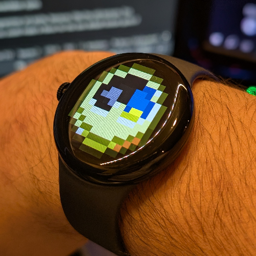
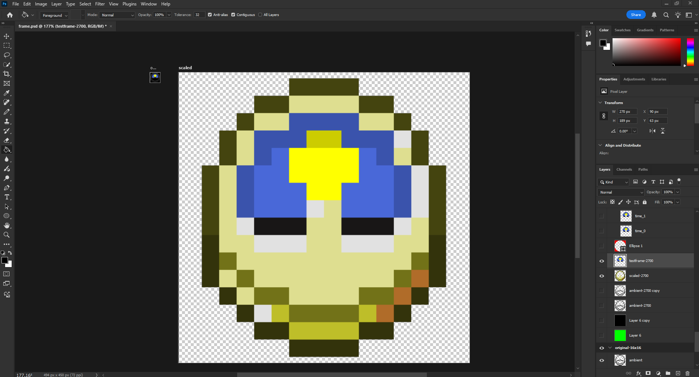

# MCClock

A Wear OS 5 watchface that shows the time using Minecraft's Clock sprite. **If you'd like to use it, download the apk from the [releases page](https://github.com/Zyplos/MCClock/releases).** You'll have to use [adb or something](https://www.google.com/search?q=install+apk+on+wear+os+watch) to install it on your watch. Sorry it isn't on the Play Store, this is a small one off project and technically I don't think this would be allowed on there anyway since I just ripped off the sprite from Minecraft.

Credits to Gemini 2.0 Pro Experimental 02-05 for helping.

*7:35pm.*

## Project Setup

Clone this repo and open it in Android Studio. Please note you'll need the `validator-plugin` project from [android/wear-os-samples/WatchFaceFormat](https://github.com/android/wear-os-samples/tree/main/WatchFaceFormat). The project expects it to be in the same directory as the one you extracted this project to.

## Programmer Art?

*"Flavors" is what Wear OS calls different watchface styles.*

This project contains one Flavor: the programmer art sprite, because I like the old textures. This project uses Watch Face Format v2, so you could make a flavor for the new default texture sprite if you'd like. 

The watchface sprite is made with 2 layers: the time frame and the clock frame on top. Both are pngs that are 450x450. They were made by manually going through all 64 clock sprites and masking out the clock frame. The Clock frame and each masked time frame are resized by 2700% and repositioned on a 450x450 canvas.

*This could have been automated, sure, but it didn't take too long to do all this.*

## Extras?

Originally this project was going to be the clock frame and a single time frame that rotates throughout the day but I wanted it to look accurate to how it is in the game.

I thought to change the icons based on weather or the moon icon based on the real moon phase since the data enabling this behavior is there. However with how the sprites were made in the end it would be a lot of work (but it would be possible).

There are also no complications on purpose. I think it looks nice just having the clock.

This project targets Wear OS 5 because that's what my Pixel Watch Gen 1 is on. However, if you're on Wear OS 4, you should probably be able to build this project for it if you [change some stuff around](https://developer.android.com/training/wearables/wff/setup#declare-wff-use).

REF 

https://developer.android.com/training/wearables/wff/setup
https://developer.android.com/training/wearables/wff/weather
https://developer.android.com/training/wearables/wff/group/group
https://developer.android.com/training/wearables/wff/group/part/image/part-image
https://developer.android.com/training/wearables/wff/common/condition?version=2
https://developer.android.com/training/wearables/wff/common/attributes/arithmetic-expression
https://stackoverflow.com/questions/19496907/set-date-time-using-adb-shell